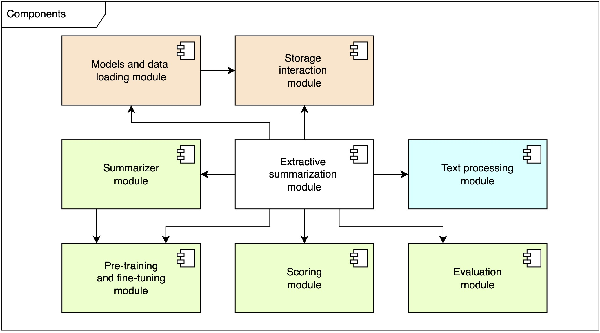
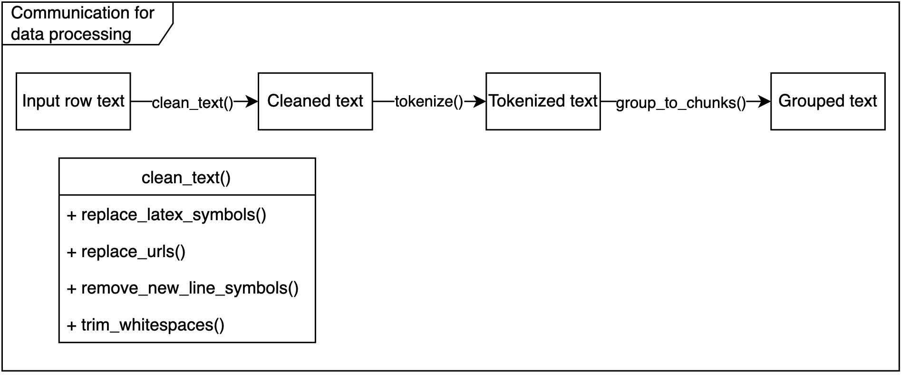
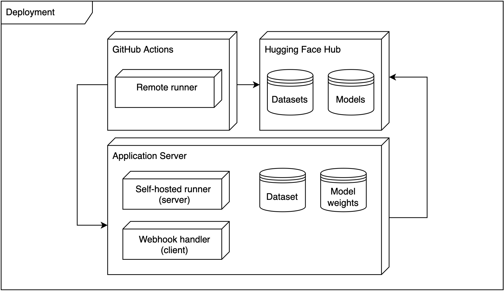

# NLPaper

**NLPaper** is an app that will help you to highlight the most
important information of an ML-related research paper.

**Author:** Aleksei Artemiev.

[Link](https://github.com/aalksii/nlpaper) to repo.

## Aim 

To develop an extractive summarization system for ML-related research papers.

## Tasks

1. Research current approaches for extractive summarization;
2. develop the system architectures (diagrams);
3. collect and analyze the data from research papers (arXiv); 
4. develop preprocessing pipeline for the text; 
5. pre-train (or prepare) transformer models (DistilBERT and ALBERT) and
   tokenizers;
6. fine-tune the models using a masked language modeling (MLM) objective;
7. use the models as feature extractors with a summarizer and get top n
   sentences;
8. evaluate metrics on the dataset (perplexity) and select the 
best model based on the metric;
9. deploy the service on an application server;
10. optimize the selected model (or data) (i.e. compress it);

## Dataset

### Link:
[🤗 aalksii/ml-arxiv-papers](https://huggingface.co/datasets/aalksii/ml-arxiv-papers)

### Description:
The dataset consists of 117592 research paper abstracts from arXiv. 
The train and test ratio is 9:1, so it makes 105832 and 11760 rows.
The original dataset can be found on 
[Kaggle](https://www.kaggle.com/datasets/Cornell-University/arxiv) and 
ML papers only version on 
[CShorten/ML-ArXiv-Papers](https://huggingface.co/datasets/CShorten/ML-ArXiv-Papers). 
The average length of the abstracts is 1157 symbols.

### Expediency of its use: 

- The abstracts can be used to fine-tune BERT-based models using masked language
modeling technique. Since a BERT model was pre-trained using only an unlabeled,
plain text corpus (English Wikipedia, the Brown Corpus), it can be less
prepared for a scientific language such as that found in arXiv dataset.
However, the dataset can be edited with masking and fed into the models. Then
it is possible to use such a fine-tuned model for sentence embeddings.

- The topic of all papers in the dataset is machine learning, so it should
be easier for a model to adapt to a new domain.

- The selected models are much more compact compared to BERT. 
Therefore, it is possible to train these models using a single GPU machines, 
such as Google Colab.

## Project diagrams

### Component diagram

*Figure 1. Pipeline components*

### Communication diagram

*Figure 2. Text processing communication pipeline*

### Activity diagram

*Figure 3. Model usage pipeline*

### Deployment diagram

*Figure 4. Deployment pipeline*

## Data preparation

The [manually](https://huggingface.co/datasets/aalksii/ml-arxiv-papers) 
created dataset (look at the notebook to check how it was done) is loaded on
🤗 public repository. In this project, I use 🤗 API to load data from this repo.
All the parameters can be changed using configuration files in `src` directory.

## Pre-training and fine-tuning

The pipeline for training used in the project is: 
1. Load model weights from [aalksii/distilbert-base-uncased-ml-arxiv-papers](https://huggingface.co/aalksii/distilbert-base-uncased-ml-arxiv-papers) and 
[aalksii/albert-base-v2-ml-arxiv-papers](https://huggingface.co/aalksii/albert-base-v2-ml-arxiv-papers) 
-- these models are DistilBERT and ALBERT pre-trained models which fine-tuned 
on the part of the dataset, but we could skip this step and use common versions 
of the models.
2. Pre-train: use part of the dataset to train these models.
3. Fine-tune: the same as 2, however, we use pre-trained models from step 2.

## Choosing the optimal model

To choose the best model among fine-tuned, I compare them using few metrics.
The formula to get the score is: 
`score(model)=RelativeChange(Perplexity(model))+RelativeChange(InferenceTime(model))+InferenceTime(model)`, 
where `RelativeChange` is computed for pre-trained and fine-tuned models. 
After we compute score for each model, we can use `argmax` to select 
the best one.

## Deployment

The first way to deploy the service was Heroku, but it was hard to create 
a container with the size less than 500 MB (my Python's cache on 
GitHub takes 2 GB). So I decided to move to DigitalOcean (thanks to GitHub's 
education pack) and created a droplet with 2 GB RAM, 1 vCPU, and 50 GB SSD.
After this, I launched a GitHub Actions service as a self-hosted machine to use 
with the repo (take a look at the workflow file). To process a text and 
get a summary, we send request to `localhost`, which is hosted by server 
with REST API. The server uses fine-tuned models to predict the result.

## Next steps

Next possible steps to take:

- develop a cross-validation evaluation pipeline to 
ensure that perplexity is not affected by random masking;

- replace latex symbols and urls with a new token 
to let the model pay attention on it;

- use other BERT-based architectures;
